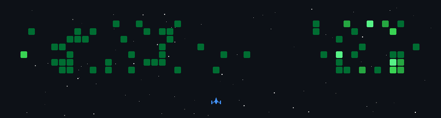

# Hey, I'm YOLO 👋

CS grad student building useful prototypes with AI, software, and the occasional robot.

My current mode is **vibe coding with engineering follow-through**: use AI to move quickly from idea to working demo, then shape the prototype into something explainable, testable, and worth showing.

## What I'm building

- **6gogo_scout_mini** — an award-winning hackathon project for walking a Scout Mini robot dog with a ROS 2 control stack and web UI.
- **Knowater / Weread Memory** — a hackathon-built Obsidian plugin that helps readers recover context from WeChat Reading notes instead of starting cold every time.
- **Personal site** — a public portfolio and build log that tracks the projects as they become real: [awesomebaron001.github.io](https://awesomebaron001.github.io)

## I reach for

Python · TypeScript · Next.js · ROS 2 · Obsidian plugins · LangGraph · LangChain

## Featured projects

| Project | What it is | Stack |
| --- | --- | --- |
| [6gogo_scout_mini](https://github.com/AwesomeBaron001/6gogo_scout_mini) | Hackathon-winning Scout Mini dog-walk demo: route presets, ROS bridge, robot status, and a browser control surface. | ROS 2 Jazzy, Python, rosbridge, Web UI |
| [Knowater](https://github.com/AwesomeBaron001/Knowater) | Obsidian reading-memory plugin for WeChat Reading exports: dashboard, recovery card, and reading-session summaries. | TypeScript, Obsidian API, Markdown |
| [Personal Site](https://github.com/AwesomeBaron001/AwesomeBaron001.github.io) | Portfolio and build log deployed on GitHub Pages. | Next.js, TypeScript, Tailwind CSS |

**Find me:** [Site](https://awesomebaron001.github.io) · [Blog](https://blog.csdn.net/m0_46464899) · hollyzhao001@gmail.com

---

*and just for fun —*

*My GitHub contributions as a space shooter · updated daily*

